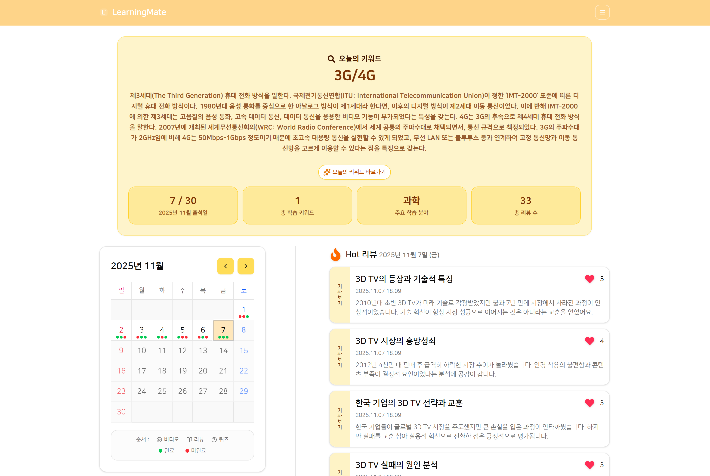
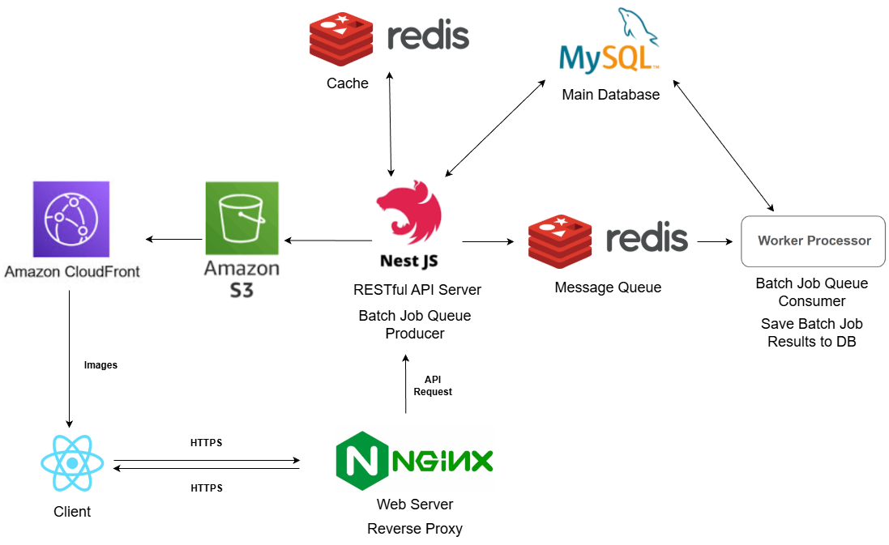

# Learningmate



**🔗 Demo**: [https://learningmate.cloud](https://learningmate.cloud)

## 프로젝트 설명

경제 용어 학습을 돕는 AI 기반 학습 플랫폼입니다. 매일 새로운 경제 용어와 관련 학습 콘텐츠(동영상, AI 생성 아티클, 퀴즈)를 제공하여 경제 지식을 체계적으로 쌓을 수 있도록 돕습니다.

**개발 기간**: 2025.8월 ~ 2025.11월

**팀 구성**: 3명

해당 프로젝트는 기존 3인 팀으로 개발했던 Spring Boot 코드를 기반으로 마이그레이션한 프로젝트이며, NestJS로의 마이그레이션 및 기능 확장은 모두 혼자서 진행했습니다.

## 서버 아키텍처



### Application Server

- NestJS기반 RESTful API 서버
- JWT 기반 인증/인가 구현

### Database

- **MySQL**: 메인 데이터베이스
- **Redis**:
  - Refresh Token 저장
  - 데이터 캐싱
  - 메시지 큐 (BullMQ)

### Worker Processor

- Redis Queue 기반 비동기 배치 작업 처리

### Nginx

- Reverse Proxy - API 요청을 NestJS로 전달
- Web Server - React 정적 파일 서빙
- SSL Termination Point - HTTPS 암호화 처리

### AWS S3 & AWS CloudFront

- 객체 스토리지
- CDN

## 기술 스택

- **Backend**: NestJS, TypeScript, Prisma, Passport.js, Zod, Swagger, Jest
- **Database**: MySQL, Redis
- **Worker**: BullMQ, cheerio
- **External APIs**: Brave Search API, LLM API
- **Infrastructure**: Nginx, Docker, AWS EC2, AWS ECR, AWS S3

## 프로젝트 구조

```text
src/
├── core/                      # 핵심 공통 기능
│   ├── config/               # 환경 변수 검증 등 설정
│   ├── constants/            # 상수 정의
│   ├── types/                # 공통 타입 정의
│   ├── api-response/         # API 응답 포맷
│   ├── exception/            # 예외 처리
│   ├── infrastructure/       # 인프라 레이어
│   │   ├── io-redis/        # Redis 클라이언트
│   │   ├── prisma-module/   # Prisma ORM
│   │   ├── s3/              # AWS S3
│   │   ├── email/           # 이메일 서비스
│   │   └── cookie/          # 쿠키 관리
│   ├── pipes/                # 검증 파이프
│   ├── interceptors/         # 인터셉터
│   └── resources/            # 리소스 (이메일 템플릿)
├── features/                  # 기능별 모듈
│   ├── admin/               # 관리자 및 배치 작업
│   ├── article/             # 아티클
│   ├── auth/                # 인증/인가
│   ├── keyword/             # 경제 키워드
│   ├── member/              # 회원 관리
│   ├── quiz/                # 퀴즈
│   ├── review/              # 학습 리뷰
│   ├── statistic/           # 통계
│   ├── study/               # 학습 기록
│   └── video/               # 유튜브 영상
├── app.module.ts             # 루트 모듈
└── main.ts                   # 애플리케이션 진입점
```

## 주요 기능

### 학습 기능

- **일일 경제 키워드 제공**: 매일 새로운 경제 용어와 설명을 제공
- **다양한 학습 콘텐츠**: 키워드 관련 유튜브 영상, AI 생성 아티클 제공
- **인터랙티브 퀴즈**: 학습한 내용을 확인할 수 있는 퀴즈 시스템
- **학습 리뷰 작성**: 학습한 키워드에 대한 개인 리뷰 작성

### 회원 기능

- **회원가입/로그인**: JWT 기반 인증 시스템
- **학습 기록 추적**: 개인별 학습 진도 및 히스토리 관리
- **학습 통계**: 학습 달성률, 진행 상황 시각화

### 관리자 기능

- **콘텐츠 관리**: 경제 키워드, 아티클, 퀴즈 관리
- **배치 작업**: 일일 콘텐츠 생성

## 주요 기능 구현 세부사항

### 1. 사용자 인증 시스템

#### JWT 기반 인증/인가 아키텍처

- **Passport.js**를 활용한 전략 패턴 기반 인증 구현
- Access Token과 Refresh Token을 분리한 이중 토큰 메커니즘 설계

#### 보안 강화 구현

- **Refresh Token 관리**: UUID v4 기반 생성 후 Redis에 저장 및 관리
- **토큰 저장 방식**: `Secure`, `HttpOnly`, `SameSite=Lax` 플래그를 설정한 쿠키 방식 채택으로 XSS 공격 방어 및 크로스 사이트 요청 제한
- **Token Rotation**: Refresh Token을 이용한 Access Token 갱신 시 Refresh Token도 함께 재발급하는 RTR(Refresh Token Rotation) 전략 적용으로 토큰 탈취 리스크 최소화

#### 기술적 의사결정

- **Redis 선택 이유**: 빠른 조회 성능과 TTL 기반 자동 만료 처리로 세션 관리에 최적화
- **쿠키 기반 저장 선택 이유**: 클라이언트 JavaScript의 직접 접근 차단(`HttpOnly`)을 통한 XSS 공격 방어

### 2. 성능 최적화

#### Redis 캐싱 전략

- **캐싱 대상**: 키워드, 아티클, 퀴즈 등 자주 조회되는 데이터
- **효과**: 동일한 데이터에 대한 반복적인 DB 조회 최소화

#### BullMQ를 활용한 백그라운드 작업 처리

- **문제 인식**: 아티클 및 퀴즈 생성과 같은 무거운 배치 작업을 메인 스레드에서 실행 시, 이벤트 루프가 블로킹되어 API 응답 지연 발생
- **해결 방법**: BullMQ를 사용해 배치 작업을 별도의 워커 프로세스로 분리하여 비동기 처리
- **효과**: 배치 작업 실행 중에도 API 서버의 안정적인 응답 시간 유지

### 3. AI 기반 아티클 및 퀴즈 생성 파이프라인

> Worker의 코드는 [여기](https://github.com/diuyuy/learningmate_batch_worker)에서 확인하실 수 있습니다.

1. **데이터 수집**
   - **Brave Search API**를 통해 키워드 관련 검색 결과 상위 20개 수집

2. **콘텐츠 추출**
   - **Cheerio** 라이브러리로 HTML 파싱 및 본문 텍스트 추출
   - 광고, 스크립트 등 불필요한 요소 제거

3. **관련 문서 선별**
   - BM25 알고리즘으로 키워드와의 관련도 점수 계산
   - 상위 7개 문서를 컨텍스트로 선정

4. **AI 콘텐츠 생성**
   - 사용 모델: Gemini 2.5 Flash
   - 선별된 문서를 프롬프트에 포함하여 아티클 및 퀴즈 생성 요청

5. **콘텐츠 저장**
   - 데이터베이스에 생성된 콘텐츠 저장
